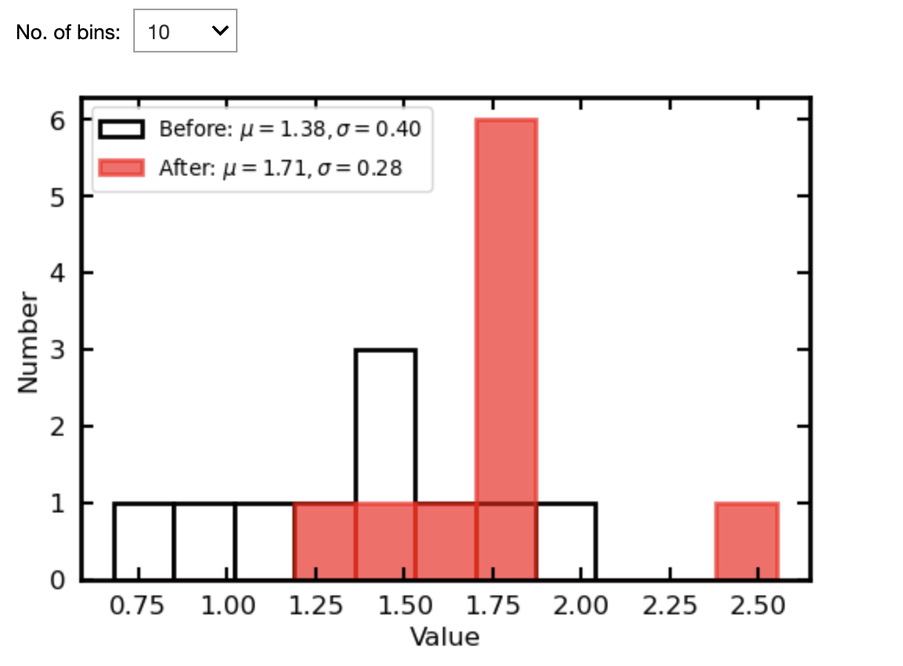
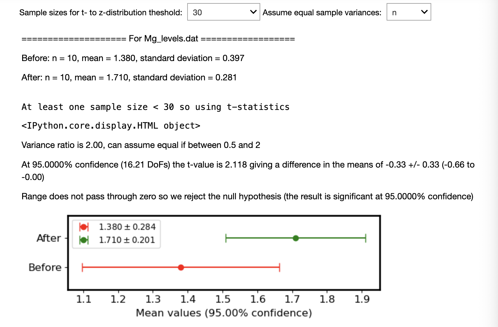
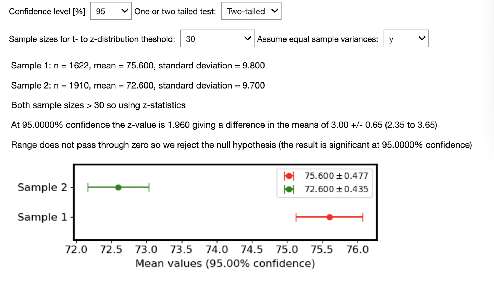
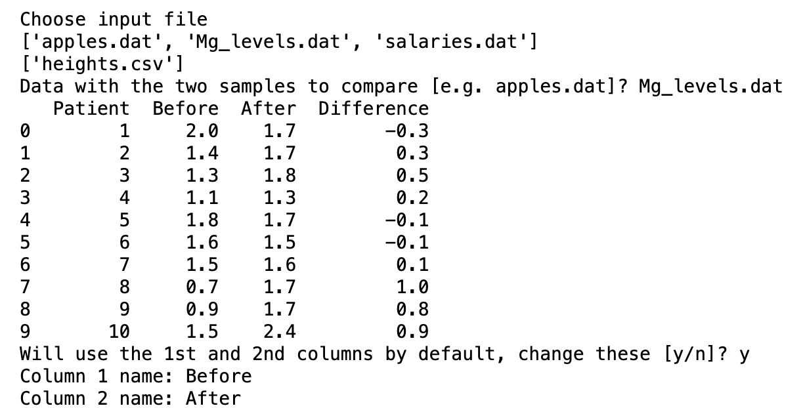

# A/B Testing Toolkit

An interactive Streamlit application for comparing the means of two independent samples using confidence intervals and hypothesis testing.

| Histogram | Results | Confidence Intervals |
|------------|---------|----------------------|
|  |  |  |

Designed for analysts, researchers and students, the toolkit automates common statistical calculations while providing clear visualisations and explanations of the results.

The repository also contains the original Jupyter notebook used during development for those interested in the underlying methodology.

🚀 **Run online**  https://ka3za9cakrov8s8csaad4k.streamlit.app

📓 **Run notebook:** `notebooks/ab_testing.ipynb`

💻 **Run locally**

Clone the repository

	git clone https://github.com/steviecurran/ab-testing-toolkit.git
	cd ab-testing-toolkit

Create a virtual environment

	python3 -m venv .venv
	source .venv/bin/activate

Install the dependencies

	pip install -r requirements.txt

Launch Streamlit

	streamlit run app/ab_testing_app.py

## Features
📊 Compare two independent sample means

📈 Automatic selection of z or t statistics

📐 Equal variance (pooled) or Welch's unequal variance test

🎯 One- or two-tailed hypothesis tests

📏 Adjustable confidence level

📂 Load data from:
	-repository datasets
	- local CSV/DAT files
	- URL
	- summary statistics

📉 Histogram comparison of sample distributions

📍 Publication-style confidence interval plots

📋 Plain-English interpretation of statistical results

## Repository structure

	.
	├── app
	│   └── ab_testing_app.py
	├── src
	│   └── statistics.py
	├── data
	├── notebooks
	├── assets
	└── README.md

## Example workflow

###Example 1 – Magnesium supplement study

The repository contains a small example dataset (Mg_levels.dat) comparing magnesium levels before and after supplementation.

The histogram illustrates the distributions.

### Example 2 – Blood pressure

Using summary statistics only, the toolkit compares systolic blood pressure for men and women.

Although the difference in means is relatively small, the large sample size results in a statistically significant difference.

## Statistical methods

The application supports

- Independent two-sample t-test
- Welch's t-test
- z approximation for large samples
- Confidence intervals
- Hypothesis testing
- Effect estimation

## Original notebook

The original notebook used to develop the toolkit is available in

	notebooks/ab_testing.ipynb

It documents the development process and provides additional explanation of the underlying statistical methods.

## Future improvements

- Effect size measures (Cohen's d)
- Power analysis
- Paired t-test
- Proportion testing
- Bootstrap confidence intervals

## Licence

MIT Licence
